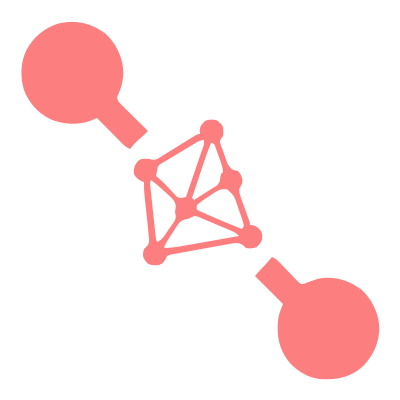
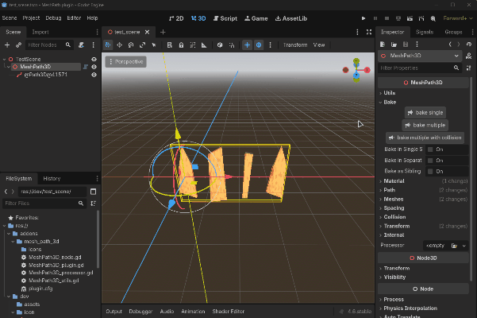

  

<h1 align="center">
  MeshPath3D
</h1>

  

## See my other plugins

- [Awaiter](https://github.com/MeroVinggen/Godot-AwaiterPlugin)
- [Projectile on curve 2D](https://github.com/MeroVinggen/Godot-ProjectileOnCurve2DPlugin)
- [Android Internet Connection State](https://github.com/MeroVinggen/Godot-AndroidInternetConnectionStatePlugin)
- [
Vector2 editor](https://github.com/MeroVinggen/Godot-Vector2ArrayEditorPlugin)
- [
Threaded Resource Save-Load](https://github.com/MeroVinggen/Godot-ThreadedResourceSaveLoadPlugin)

## About

This plugin allows you to distribute meshes along Path3D with gaps, randomization, and transforms.

## Features

- use in editor or at runtime
- runtime generation utils
- placing meshes by random order
- set static/random gaps and edges margin
- adjust static/random rotation, scale, offset
- bake meshes and collisions
- control the meshes/baking via custom logic that integrates into pipeline
  

## Requirements 

- Godot 4.5 or higher

## Installation

- Open the `AssetLib` tab in Godot with your project open
- Search for `MeshPath3D` plugin and install the plugin by Mero
- Open Project -> Project Settings -> Plugins Tab and enable the plugin `MeshPath3D`
- Done!

## Tutorials

- [Base usage and settings overview](https://youtu.be/Zi7eKfs-HbU)
- [Vertical wall settings overview](https://youtu.be/VNDj5EpiI4M)
